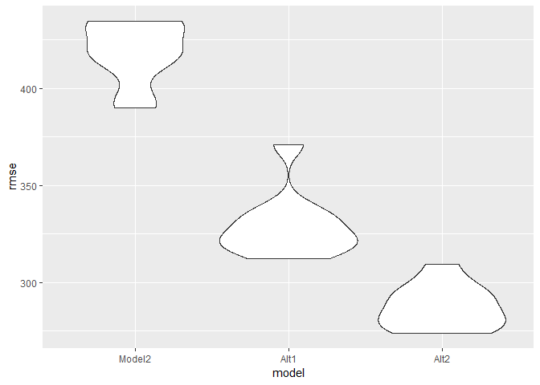

p8105\_hw6\_yz3297
================
Yue Zhao
2018年11月23日

Problem 1
---------

``` r
homicide_data= read_csv(file="./data/homicide-data.csv") %>%
   mutate(city_state=paste(city,state,sep=", ")) %>%
   mutate(solved= ifelse(disposition=="Closed by arrest","solved","unsolved")) %>% 
   filter(city_state != "Dallas, TX" & city_state != "Phoenix, AZ" & city_state !="Kansas City, MO" & city_state !="Tulsa, AL") %>% 
   mutate(victim_race= ifelse(victim_race=="White","white","non-white")) %>% 
   mutate(victim_age=as.numeric(victim_age),victim_race = fct_relevel(victim_race, "white"))
```

#### I first created city\_state and then deleted the entries that was not useful. And then I changed the race variable to be binary and set the reference group as white.

``` r
fit_logistic = 
  homicide_data %>% 
  filter(city_state=="Baltimore, MD") %>% 
  mutate(solved=as.numeric(disposition == "Closed by arrest")) %>% 
  glm(solved ~ victim_age + victim_sex + victim_race , data = ., family = binomial()) %>% 
  broom::tidy() %>% 
  mutate(OR = exp(estimate),CILOW=exp(estimate-std.error),CIUP=exp(estimate+std.error)) %>% 
  filter(term=="victim_racenon-white") %>% 
  select(OR,CILOW,CIUP)

fit_logistic %>% 
   knitr::kable(digits=3) 
```

|     OR|  CILOW|   CIUP|
|------:|------:|------:|
|  0.441|   0.37|  0.525|

#### This code chunk was to calculate the OR of solving the case comparing non white to white victims. I used a logistic regression for the data in Baltimore, MD. I first changed the "solved" as a 0,1, then I used gm function. Then I only reserved the race OR and calculated the 95% CI. The OR and 95% CI for Baltimore was presented in the table.

``` r
final_OR= 
  homicide_data %>% 
  mutate(solved=as.numeric(disposition == "Closed by arrest")) %>% 
  select(city_state,solved,victim_age,victim_sex,victim_race) 

orfunc1= function(x) {
  glm(solved ~ victim_age + victim_sex + victim_race , data = x, family = binomial()) %>% 
  broom::tidy() %>% 
  filter(term=="victim_racenon-white")
}
```

#### The final\_OR dataset is to create a clean dataset that only includes the data we need for the OR calculation. Then I define a function to do the logistic regression and get the beta estimate and standard error terms.These are prepared to be used in the mapping step coming up next.

``` r
final_OR2 = 
  final_OR %>% 
  group_by(city_state) %>% 
  nest() %>% 
  mutate(map2= map(data, orfunc1)) %>%
  select(city_state,map2) %>% 
  unnest() %>% 
  mutate(OR = exp(estimate),CILOW=exp(estimate-std.error),CIUP=exp(estimate+std.error)) %>% 
  select(city_state,OR,CILOW,CIUP)
  
final_OR2 %>% 
  knitr::kable(digits=3) 
```

| city\_state        |     OR|  CILOW|   CIUP|
|:-------------------|------:|------:|------:|
| Albuquerque, NM    |  0.741|  0.576|  0.955|
| Atlanta, GA        |  0.753|  0.567|  1.000|
| Baltimore, MD      |  0.441|  0.370|  0.525|
| Baton Rouge, LA    |  0.668|  0.453|  0.983|
| Birmingham, AL     |  1.039|  0.795|  1.358|
| Boston, MA         |  0.115|  0.073|  0.180|
| Buffalo, NY        |  0.390|  0.286|  0.531|
| Charlotte, NC      |  0.558|  0.421|  0.739|
| Chicago, IL        |  0.562|  0.491|  0.644|
| Cincinnati, OH     |  0.318|  0.241|  0.421|
| Columbus, OH       |  0.855|  0.734|  0.995|
| Denver, CO         |  0.602|  0.462|  0.783|
| Detroit, MI        |  0.651|  0.562|  0.755|
| Durham, NC         |  1.003|  0.631|  1.594|
| Fort Worth, TX     |  0.838|  0.679|  1.034|
| Fresno, CA         |  0.448|  0.319|  0.628|
| Houston, TX        |  0.873|  0.779|  0.977|
| Indianapolis, IN   |  0.505|  0.438|  0.582|
| Jacksonville, FL   |  0.658|  0.573|  0.755|
| Las Vegas, NV      |  0.755|  0.664|  0.860|
| Long Beach, CA     |  0.794|  0.551|  1.144|
| Los Angeles, CA    |  0.666|  0.565|  0.784|
| Louisville, KY     |  0.392|  0.317|  0.484|
| Memphis, TN        |  0.782|  0.638|  0.960|
| Miami, FL          |  0.576|  0.464|  0.715|
| Milwaukee, wI      |  0.632|  0.503|  0.795|
| Minneapolis, MN    |  0.646|  0.469|  0.889|
| Nashville, TN      |  0.899|  0.764|  1.057|
| New Orleans, LA    |  0.466|  0.369|  0.589|
| New York, NY       |  0.531|  0.383|  0.738|
| Oakland, CA        |  0.213|  0.148|  0.306|
| Oklahoma City, OK  |  0.681|  0.569|  0.816|
| Omaha, NE          |  0.169|  0.125|  0.228|
| Philadelphia, PA   |  0.644|  0.558|  0.743|
| Pittsburgh, PA     |  0.282|  0.212|  0.375|
| Richmond, VA       |  0.447|  0.266|  0.752|
| San Antonio, TX    |  0.689|  0.562|  0.846|
| Sacramento, CA     |  0.781|  0.588|  1.036|
| Savannah, GA       |  0.596|  0.406|  0.877|
| San Bernardino, CA |  0.880|  0.583|  1.328|
| San Diego, CA      |  0.483|  0.377|  0.619|
| San Francisco, CA  |  0.458|  0.363|  0.578|
| St. Louis, MO      |  0.577|  0.482|  0.690|
| Stockton, CA       |  0.376|  0.270|  0.523|
| Tampa, FL          |  1.159|  0.819|  1.639|
| Tulsa, OK          |  0.602|  0.497|  0.730|
| Washington, DC     |  0.510|  0.360|  0.723|

#### Then I nested the regression variables and mapped the dataset to a dataset with city\_state, data, map2. Then I dropped data and unnest the dataset. I mutated to create a the OR and confidence interval estimate. Finally, I dropped other variables.

``` r
final_OR2 %>% 
  mutate(city_state = fct_reorder(city_state,OR,.desc=TRUE)) %>%
  ggplot(aes(x = city_state, y = OR)) +
        geom_point() +
        labs(title = "OR and 95%CI by Cities",
             x = "City",
             y = "OR and 95%CI",
             Caption = "OR and 95%CI by Cities") +
        geom_errorbar(aes(ymin = CILOW, ymax = CIUP)) +
        coord_flip()
```


#### I plotted the OR and 95% CI by each city. The plot shows most of the cities have an OR less than 1, which means the cases with a non white victim are less likely to get solved. This shows the same conclusion in the article.

Problem 2
---------

``` r
birthweight = read_csv(file = "./data/birthweight.csv") %>% 
  mutate(babysex = as.factor(babysex),
         frace = as.factor(frace),
         malform = as.factor(malform),
         mrace = as.factor(mrace))

reg_result1 = lm(bwt ~ babysex + delwt + fincome + frace + gaweeks + malform + menarche + mheight + momage 
                + mrace + parity + pnumlbw + pnumsga + ppbmi + ppwt + smoken + wtgain, data = birthweight) %>% 
broom::tidy()
```

#### I first decided to throw away blength and bhead because regression model is to predict the birthweight of the baby. These are measured after the baby is born and thus the weigtht of the baby is known by the time of knowing the baby's length and baby's head circumference. The selection method I used for the linear model is that I ran a full regression on all the variables and then select significant varibles with the p values less than 0.01. (a combination of theoretical and data driven method)

### Model 1

``` r
reg_result1  %>% 
knitr::kable(digits=3) 
```

| term        |   estimate|  std.error|  statistic|  p.value|
|:------------|----------:|----------:|----------:|--------:|
| (Intercept) |  -2446.389|   1013.614|     -2.414|    0.016|
| babysex2    |    -88.183|     12.782|     -6.899|    0.000|
| delwt       |      9.599|      0.598|     16.060|    0.000|
| fincome     |      0.234|      0.276|      0.849|    0.396|
| frace2      |   -117.662|     70.988|     -1.657|    0.097|
| frace3      |    -44.015|    106.652|     -0.413|    0.680|
| frace4      |    -82.310|     68.760|     -1.197|    0.231|
| frace8      |     -8.200|    114.010|     -0.072|    0.943|
| gaweeks     |     53.080|      2.096|     25.322|    0.000|
| malform1    |    -36.480|    108.698|     -0.336|    0.737|
| menarche    |     -3.955|      4.455|     -0.888|    0.375|
| mheight     |     47.638|     15.854|      3.005|    0.003|
| momage      |      0.275|      1.881|      0.146|    0.884|
| mrace2      |   -164.680|     70.875|     -2.324|    0.020|
| mrace3      |    -25.724|    110.689|     -0.232|    0.816|
| mrace4      |    -17.544|     69.436|     -0.253|    0.801|
| parity      |    114.538|     62.297|      1.839|    0.066|
| ppbmi       |     44.905|     22.905|      1.960|    0.050|
| ppwt        |    -13.494|      4.015|     -3.360|    0.001|
| smoken      |    -11.888|      0.893|    -13.319|    0.000|

The significant ones are gaweeks, delwt, smoken, babysex, mrace, fincome, momage, ppwt. Then we fit a second model including only the significant variables.

### Model 2

``` r
reg_result2= lm(bwt ~ gaweeks + delwt + smoken + babysex + mrace + fincome + momage + ppwt , data = birthweight)

reg_result2  %>% 
broom::tidy() %>% 
knitr::kable(digits=3) 
```

| term        |  estimate|  std.error|  statistic|  p.value|
|:------------|---------:|----------:|----------:|--------:|
| (Intercept) |   416.293|     95.278|      4.369|    0.000|
| gaweeks     |    52.925|      2.097|     25.235|    0.000|
| delwt       |     9.928|      0.597|     16.633|    0.000|
| smoken      |   -11.806|      0.895|    -13.197|    0.000|
| babysex2    |   -85.978|     12.829|     -6.702|    0.000|
| mrace2      |  -284.182|     15.497|    -18.337|    0.000|
| mrace3      |   -81.536|     66.007|     -1.235|    0.217|
| mrace4      |  -132.799|     29.318|     -4.530|    0.000|
| fincome     |     0.390|      0.275|      1.418|    0.156|
| momage      |     0.467|      1.848|      0.253|    0.800|
| ppwt        |    -5.155|      0.658|     -7.830|    0.000|

``` r
birthweight %>% 
select(bwt,gaweeks,delwt ,smoken , babysex , mrace ,fincome , momage , ppwt , mheight) %>% 
modelr::add_predictions(reg_result2) %>% 
modelr::add_residuals(reg_result2) %>% 
ggplot(aes(x = resid, y = pred, color = bwt)) + geom_point()
```


#### The residual is fairly symmetric to 0 and this means the variance of the data do not vary by the predicted value (which means no heteroscedasticity).

``` r
reg_resultAlt1 = lm(bwt ~ blength + gaweeks, data = birthweight)
reg_resultAlt2 = lm(bwt ~ bhead + blength + babysex + bhead * blength + bhead * babysex + blength * babysex
          + bhead * blength * babysex, data = birthweight)

cv_df = 
  crossv_mc(birthweight, 10) %>% 
  mutate(train = map(train, as_tibble),
         test = map(test, as_tibble)) %>% 
  mutate(reg_result2 = map(train, ~lm(bwt ~ gaweeks + delwt + smoken + babysex + mrace + fincome + momage + ppwt , data = .x)),
         reg_resultAlt1 = map(train, ~lm(bwt ~ blength + gaweeks, data = .x)),
         reg_resultAlt2 = map(train, ~lm(bwt ~ bhead + blength + babysex + bhead * blength + 
                                 bhead * babysex + blength * babysex + 
                                 bhead * blength * babysex, data = .x))) %>% 
  mutate(rmse_Model2 = map2_dbl(reg_result2, test, ~rmse(model = .x, data = .y)),
         rmse_Alt1 = map2_dbl(reg_resultAlt1, test, ~rmse(model = .x, data = .y)),
         rmse_Alt2 = map2_dbl(reg_resultAlt2, test, ~rmse(model = .x, data = .y)))
```

#### Then I did the cross validation between my model2 and the two alternative models.

``` r
cv_df %>% 
  select(.id, starts_with("rmse")) %>% 
  gather(key = model, value = rmse, rmse_Model2:rmse_Alt2) %>% 
  mutate(model = str_replace(model, "rmse_", ""),
         model = fct_inorder(model)) %>% 
  ggplot(aes(x = model, y = rmse)) + geom_violin()
```



#### In the plot, we can see the rmse for Aiternative 2 is the best, since it is the smallest. So the model I fit above is not the best model in terms of fitting.
